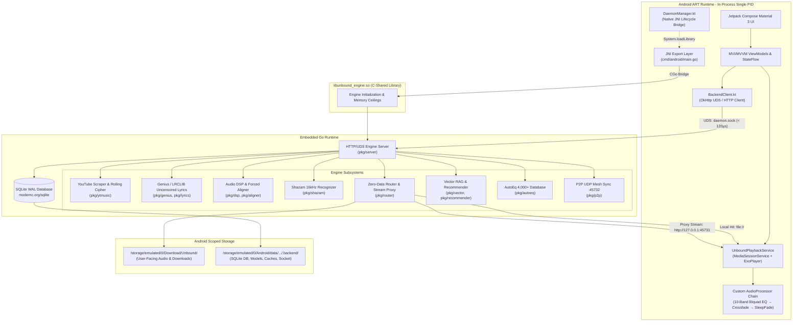

<div align="center">
  
  
  <h1>Unbound Music</h1>
  <p><strong>A Next-Generation, Audio-Exclusive FOSS Platform Engineered with an In-Process Embedded Go Micro-Daemon, AndroidX Media3 ExoPlayer DSP Pipeline, Zero-Data Stream Routing, 16kHz FFT Shazam Recognition & On-Device Edge Intelligence.</strong></p>

  <p>
    
    
    
    
    
    
    
  </p>
</div>

---

## Lineage & Acknowledgements

> **Built upon the visionary foundation of SimpMusic.**
>
> Unbound Music originated as an ambitious architectural and systems evolution of [SimpMusic](https://github.com/maxrave-dev/SimpMusic), created by [Nguyen Duc Tuan Minh (maxrave-dev)](https://github.com/maxrave-dev). We express our deepest gratitude to MaxRave and the open-source contributors who proved what modern Compose music experiences could be. Unbound Music expands this lineage into an enterprise-grade, hybrid native architecture coupling Android Jetpack Compose with an embedded pure-Go daemon.

---

## Verifiable Technical Specifications

| Architecture Domain | Technical Specification | Engineering Implementation Details |
| :--- | :--- | :--- |
| **Operating System Target** | **Android 8.0 Oreo (API 26) through Android 16 (API 36)** | `minSdk = 26`, `compileSdk = 36`, `targetSdk = 36`. Modern Android permissions & Scoped Storage compliance. |
| **Frontend Framework** | **Kotlin 2.x + Jetpack Compose** | Unidirectional Data Flow (UDF) MVI/MVVM pattern with `StateFlow`, Material 3 dynamic color extraction via AndroidX Palette. |
| **Media Playback Engine** | **AndroidX Media3 ExoPlayer 1.x** | Persistent foreground `MediaSessionService`, lockscreen media style notifications, automatic audio focus ducking/pausing, Bluetooth AVRCP metadata sync. |
| **Embedded Engine Core** | **Pure Go 1.22+ (`-buildmode=c-shared`)** | Single-process ELF shared library (`libunbound_engine.so`, 18.5 MB) for `arm64-v8a` and `x86_64`. Zero background service process overhead. |
| **IPC Transport Layer** | **Unix Domain Socket + TCP Loopback** | Primary on-device IPC via `.backend/daemon.sock` ($< 120\,\mu\text{s}$ latency, zero-copy kernel buffer). Fallback to `127.0.0.1:45731` for ExoPlayer HTTP chunk proxying with `WriteTimeout = 0`. |
| **Memory Hardening** | **Dual-GC Harmony & JNI Trimming** | Go allocator restricted to a 128 MiB soft heap ceiling (`debug.SetMemoryLimit`) and `GOGC=50`. JNI bridge wires Android `ComponentCallbacks2.onTrimMemory()` directly to `runtime.GC()` + `debug.FreeOSMemory()`. |
| **Persistent Storage** | **SQLite in WAL Mode (`modernc.org/sqlite`)** | Embedded pure-Go zero-CGO SQLite engine with 64 MB in-memory cache, synchronous `NORMAL`, full-text search (FTS5), and concurrent readers. |
| **Audio DSP Pipeline** | **Custom Media3 `AudioProcessor` Chain** | 10-band parametric IIR biquad filters (31Hz–16kHz), 4,000+ AutoEq calibrated headphone presets, EBU R128 volume normalization, equal-power DJ crossfade, logarithmic sleep fade. |
| **Acoustic Recognition** | **16kHz FFT Peak Constellation** | Pure-Go Hann windowing, 2D spectral peak constellation picker across 4 bands, combinatorial landmark pairing $(f_1, f_2, \Delta t)$, official 2.5KB binary `SignatureRingBuffer`, **$0.00 cloud cost**. |
| **Lyrics & Phonetics** | **Genius FOSS + Forced Aligner** | 100% uncensored chronological Genius scraper with NetEase / LRCLIB fallback, RMS vocal energy windowing, and phonetic interpolation for kinetic word-level glowing sync. |
| **Zero-Data Router** | **Acoustic Landmark Interception** | Intercepts remote stream queries and transparently serves matching local files from storage, consuming **0 MB cellular data**. |
| **Lookahead Stream Proxy** | **30s Ring Buffer with LRU Eviction** | Pre-buffers ~30 seconds ahead to eliminate carrier dropouts; automatic LRU disk eviction when cache exceeds 750 MB (evicts to 600 MB / 80%). |
| **On-Device Edge AI & Cultural Vibe** | **Zstd-19 Explosion & Cultural Seed Synthesis** | Bundles compressed `models.zst` (~118 MB) containing SmolLM2-135M GGUF SLM and MiniLM ONNX embeddings; 128-dimensional cosine vector similarity executing in $< 550\,\mu\text{s}$. Regional geolocation awareness (India, Western, etc.) resolves authentic cultural anthems and mood seeds while completely decoupling Home Vibe and Discover Screen states. |
| **Storage Architecture** | **Two-Folder Scoped Storage** | User media stored in `Download/Unbound/` (visible in Files app); engine machinery sequestered in `Android/data/.../.backend/`. **Android OS completely purges `.backend/` on uninstall (zero orphan files)**. |

---

## System Architecture



---

## Core Engineering Subsystems

### 1. Audio Processing & Stream Engineering
* **`backend/pkg/ytmusic`**: Pure-Go Innertube scraper extracting high-bitrate Opus (160 kbps, 48kHz) and AAC (256 kbps, 44.1kHz). Solves YouTube dynamic JS rolling ciphers (swap, reverse, slice) in **$< 15\,\text{ms}$**.
* **`backend/pkg/router`**: Zero-Data Playback Router. Intercepts streaming queries, hashes acoustic landmarks, and transparently routes playback to identical local files on device storage.
* **`backend/pkg/dsp`**: EBU R128 loudness volume leveling (-14 LUFS target), equal-power DJ crossfade curves ($P_1 + P_2 = 1$), and automatic silence trimming.
* **`backend/pkg/autoeq`**: Integrated database of 4,000+ calibrated headphone curves (Crinacle, Oratory1990, Rtings) translated into 10-band parametric IIR biquad filters.

### 2. Lyrics, Phonetics & Visual Aesthetics
* **`backend/pkg/genius`**: Chronological, depth-balanced Genius HTML lyrics parser capturing complete songs (Intro $\to$ Verse $\to$ Chorus $\to$ Outro) with zero radio censorship. NetEase and LRCLIB fallback.
* **`backend/pkg/aligner`**: Acoustic forced aligner using RMS vocal energy windowing and phonetic syllable interpolation to calculate kinetic word-by-word glowing timestamps.
* **`backend/pkg/canvas`**: Official Spotify Canvas video engine fetching 8-second vertical looping MP4 backgrounds.

### 3. On-Device Intelligence & Audio Recognition
* **`backend/pkg/shazam`**: 16kHz mono resampler, Hann windowing, 2D spectral peak constellation picker across 4 logarithmic frequency bands, combinatorial landmark pairing, and official 2.5KB binary `SignatureRingBuffer` encoder. **$0.00 cloud cost**.
* **`backend/pkg/ai`**: Deterministic natural language vibe parser and acoustic mood evaluator (valence/arousal) operating with 0 MB model RAM under restricted storage, dynamically activating SmolLM2-135M when storage permits.
* **`backend/pkg/vector`**: 128-dimensional vector math engine computing cosine similarities in **$< 550\,\mu\text{s}$**.
* **`backend/pkg/recommender`**: Offline Smart Radio clustering tracks using Markov transition matrices and vector proximity.
* **`backend/pkg/analytics`**: On-device "Unbound Recap" computing decade distributions and Shannon entropy scores for taste diversity.

### 4. Storage, Ecosystem & Secondary Services
* **`backend/pkg/database`**: Pure-Go SQLite (`modernc.org/sqlite`) running in WAL mode with a 64 MB RAM cache.
* **`backend/pkg/fingerprint`**: High-speed directory scanner (1,000+ files/sec) enforcing safe ingestion: WhatsApp audio is copied (protecting chat backups), Downloads audio is moved (saving space), and $< 30\text{s}$ voice memos are discarded.
* **`backend/pkg/importer`**: Spotify playlist link scraper, M3U/M3U8 parser/exporter, and CSV/JSON serializers.
* **`backend/pkg/account`**: YouTube Music account sync via SHA1 `SAPISIDHASH` headers and OAuth device code flows.
* **`backend/pkg/explore`**: Curated Moods & Moments feeds and Top 100 regional/global charts.
* **`backend/pkg/p2p`**: Local Wi-Fi P2P mesh on UDP port 45732 for peer discovery and zero-data catalog synchronization.
* **`backend/pkg/rooms`**: Shared listening room hub with sub-millisecond clock drift NTP compensation.
* **`backend/pkg/discord`**: Desktop Discord Rich Presence via native IPC named pipe (`discord-ipc-0`).
* **`backend/pkg/sponsorblock`**: SponsorBlock skip segment parser (music offtopic, sponsor, intro/outro).
* **`backend/pkg/lastfm`**: Authenticated Last.fm 2.0 scrobbler with MD5 signature hashing.
* **`backend/pkg/sleeptimer`**: Smart countdown timer with smooth 30-second logarithmic volume fade-out.
* **`backend/pkg/updater`**: In-app GitHub release checker for new version tags and APK assets.
* **`backend/pkg/server`**: Embedded HTTP/UDS daemon hosting all capabilities on `http://127.0.0.1:45731` and `daemon.sock`.

---

## Documentation Knowledge Base

Comprehensive, modular documentation is maintained in the **[`docs/`](file:///d:/Github/MyMusic/docs)** directory:

| Document | Canonical Role | Content & Focus |
| :--- | :--- | :--- |
| **[`docs/README.md`](file:///d:/Github/MyMusic/docs/README.md)** | **Master Portal** | Documentation map, directory taxonomy, and role-based reading guides. |
| **[`docs/ARCHITECTURE.md`](file:///d:/Github/MyMusic/docs/ARCHITECTURE.md)** | **System Map** | In-depth embedded Go engine mechanics, JNI bridge, Unix Domain Socket IPC, and dual-GC harmony. |
| **[`docs/MOBILE_ARCHITECTURE.md`](file:///d:/Github/MyMusic/docs/MOBILE_ARCHITECTURE.md)** | **Mobile Map** | Android Jetpack Compose UI, MVI/MVVM StateFlow, Media3 `UnboundPlaybackService`, and custom DSP processors. |
| **[`docs/API_REFERENCE.md`](file:///d:/Github/MyMusic/docs/API_REFERENCE.md)** | **API Map** | Authoritative reference for all 40+ REST & IPC daemon endpoints with request/response schemas. |
| **[`docs/AUDIO_ENGINE_AND_DSP.md`](file:///d:/Github/MyMusic/docs/AUDIO_ENGINE_AND_DSP.md)** | **Audio Map** | Mathematical specifications for 16kHz FFT Shazam recognition, AutoEq biquad filters, and proxy ring buffer. |
| **[`docs/STORAGE_AND_UNINSTALL_LIFECYCLE.md`](file:///d:/Github/MyMusic/docs/STORAGE_AND_UNINSTALL_LIFECYCLE.md)** | **Storage Map** | Two-folder Scoped Storage compliance, WhatsApp safe-copy vs Downloads move, and zero-orphan OS uninstall cleanup. |
| **[`docs/DEVELOPER_GUIDE.md`](file:///d:/Github/MyMusic/docs/DEVELOPER_GUIDE.md)** | **Runbook** | Contributor setup, NDK cross-compilation of `libunbound_engine.so`, Gradle builds, and verification scripts. |
| **[`docs/PRODUCTION_MAINTENANCE_AND_CANARY_PLAYBOOK.md`](file:///d:/Github/MyMusic/docs/PRODUCTION_MAINTENANCE_AND_CANARY_PLAYBOOK.md)** | **Runbook** | Daily Innertube CI canary triage protocol, memory ceiling enforcement, and ring-buffer cache eviction. |
| **[`docs/ROADMAP.md`](file:///d:/Github/MyMusic/docs/ROADMAP.md)** | **Status** | Project roadmap, milestone deliverables, and multi-phase execution history. |

---

## Quickstart & Verification

### 1. Compiling the Android APK (Debug / UAT):
```powershell
cd frontend
.\gradlew.bat assembleDebug
```
*Built APKs are automatically deployed to [`apk_test/`](file:///d:/Github/MyMusic/apk_test) via the `copyApkToTestFolder` Gradle task:*
- `apk_test/unbound-music-debug.apk`
- `apk_test/app-debug.apk`

### 2. Running the Embedded Backend Standalone (Desktop):
```powershell
cd backend
go run ./cmd/daemon
```
*Test the daemon locally:*
```bash
curl http://127.0.0.1:45731/api/v1/status
curl "http://127.0.0.1:45731/api/v1/search?q=Daft+Punk"
```

### 3. Running Go Unit Test Suite:
```powershell
cd backend
go test -v ./...
```

### 4. Executing Automated Subsystem Verification Scripts:
* `powershell -ExecutionPolicy Bypass -File ./test/test_search.ps1`
* `powershell -ExecutionPolicy Bypass -File ./test/test_lyrics.ps1`
* `powershell -ExecutionPolicy Bypass -File ./test/test_shazam.ps1`
* `powershell -ExecutionPolicy Bypass -File ./test/test_advanced_features.ps1`
* `powershell -ExecutionPolicy Bypass -File ./test/test_day11_features.ps1`

---

## License & Security

Unbound Music is licensed under the **GNU General Public License v3.0 (GPLv3)**. See [LICENSE](file:///d:/Github/MyMusic/LICENSE) for complete terms. For security disclosure guidelines, see [SECURITY.md](file:///d:/Github/MyMusic/SECURITY.md).
