<div align="center">
  
  
  <h1>Unbound Music</h1>
  <p><strong>A Next-Gen, Audio-Exclusive FOSS Platform with an Embedded Go Engine, Adaptive Storage Gatekeeper, On-Device Forced Lyric Alignment & Acoustic Fingerprinting.</strong></p>

  <p>
    
    
    
    
    
  </p>
</div>

---

## Lineage & Acknowledgements

> **Built upon the visionary foundation of SimpMusic.**
>
> Unbound Music began as an ambitious architectural evolution of [SimpMusic](https://github.com/maxrave-dev/SimpMusic), created by [Nguyen Duc Tuan Minh (maxrave-dev)](https://github.com/maxrave-dev). We express our deepest gratitude to MaxRave and the open-source contributors who proved what modern Compose Multiplatform music experiences could be.

---

## What Makes Unbound Music Different

| Feature Domain | Traditional FOSS Clients | Unbound Music Hybrid Architecture |
| :--- | :--- | :--- |
| **Download Footprint** | Heavy multi-hundred MB bundles | **$\sim 36.5\text{ MB}$ Self-Contained Bundle** ($< 50\text{MB}$) with zero extra downloads |
| **Intelligence Engine** | Cloud LLM tokens or zero intelligence | **On-Device Micro-AI** (SmolLM2-135M GGUF + MiniLM ONNX + 128-dim Vector Search) |
| **Audio Recognition** | None or paid third-party APIs | **Pure-Go 16kHz FFT Peak Constellation Shazam Subsystem** ($0.00 cost) |
| **Scraper Architecture** | External cloud scraper APIs (prone to bans) | **Embedded Go Daemon** running on-device as a private micro-server (`127.0.0.1:45731`) |
| **Lyrics Pipeline** | Censored radio databases | **Genius FOSS (100% Uncensored) + On-Device CTC Forced Syllable Alignment** |
| **Visual Aesthetics** | Static album art | **Spotify Canvas 8-Second Vertical Looping Video Backgrounds** |
| **Storage Ingestion** | Unorganized file dumps | **Acoustic Fingerprinting** + WhatsApp-Safe Copy & Downloads Move |
| **Network Efficiency** | Duplicate network streams for local tracks | **Zero-Data Hybrid Router** (intercepts online requests $\to$ plays local file) |
| **Personal Analytics** | Basic play counts | **On-Device Unbound Recap** (Decade distribution + Taste Diversity entropy) |
| **Acoustic Control** | Generic system equalizers | **AutoEq 4,000+ Profiles + ReplayGain Normalization + DJ Crossfade** |

---

## Technical Documentation & Roadmap

* Detailed Roadmap & Daily Milestones: **[ROADMAP.md](file:///d:/Github/MyMusic/docs/ROADMAP.md)**
* Subsystem Architecture & REST API Reference: **[docs/README.md](file:///d:/Github/MyMusic/docs/README.md)**

---

## Core Backend Subsystems (Days 1–11)

```mermaid
graph TD
    UI[Compose Multiplatform UI] -->|HTTP REST / IPC| Daemon[Localhost Engine Daemon :45731]
    
    subgraph Audio & Streams
        Daemon --> Stream[Innertube Opus/AAC Stream Extractor]
        Daemon --> Router[Zero-Data Hybrid Playback Interceptor]
        Daemon --> DSP[ReplayGain / DJ Crossfade / Silence Trimmer]
        Daemon --> AutoEq[AutoEq 4,000+ Headphone Calibration]
    end

    subgraph Lyrics & Visuals
        Daemon --> Lyrics[Uncensored Genius Scraper + LRCLIB Fallback]
        Daemon --> Aligner[On-Device Phonetic Syllable Aligner]
        Daemon --> Canvas[Spotify Canvas 8s Looping Video]
    end

    subgraph On-Device AI & Analytics
        Daemon --> EdgeAI[SmolLM2-135M + MiniLM Vector Search]
        Daemon --> Shazam[16kHz FFT Peak Constellation Shazam Subsystem]
        Daemon --> Rec[Offline Smart Radio Recommender]
        Daemon --> Analytics[On-Device Unbound Recap & Diversity Scoring]
    end

    subgraph Storage & Ecosystem
        Daemon --> SQLite[Pure-Go SQLite Memory Bank WAL Mode]
        Daemon --> Ingest[Smart Storage Ingestion Rules]
        Daemon --> P2P[Local Wi-Fi P2P Catalog Mesh Sync]
        Daemon --> Rooms[Shared Listening Rooms Sub-ms Sync]
        Daemon --> Discord[Discord Rich Presence IPC]
        Daemon --> Sponsor[SponsorBlock Video Skip Filter]
        Daemon --> LastFM[Last.fm 2.0 Scrobbler]
        Daemon --> Podcasts[Podcasts & Episode Chapters]
        Daemon --> Explore[Moods & Top 100 Charts]
        Daemon --> Artist[Artist Discography & Similar Artists]
        Daemon --> Sleep[Sleep Timer & Volume Fade-Out]
        Daemon --> Updater[GitHub Releases Auto-Updater]
    end
```



---

## Quickstart & Verification

### Running the Backend Daemon:
```powershell
cd backend
go run ./cmd/daemon
```

### Running Test Harness:
```powershell
cd backend
go test -v ./...
```

### Automated Subsystem Test Scripts:
* `powershell -ExecutionPolicy Bypass -File ./test/test_search.ps1`
* `powershell -ExecutionPolicy Bypass -File ./test/test_lyrics.ps1`
* `powershell -ExecutionPolicy Bypass -File ./test/test_shazam.ps1`
* `powershell -ExecutionPolicy Bypass -File ./test/test_advanced_features.ps1`
* `powershell -ExecutionPolicy Bypass -File ./test/test_day11_features.ps1`
