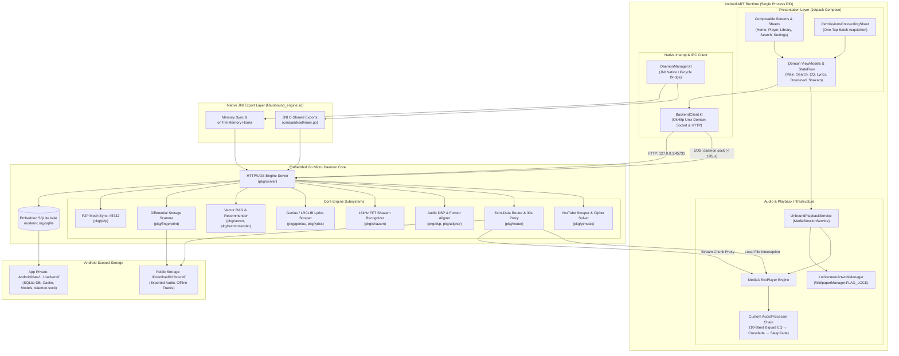
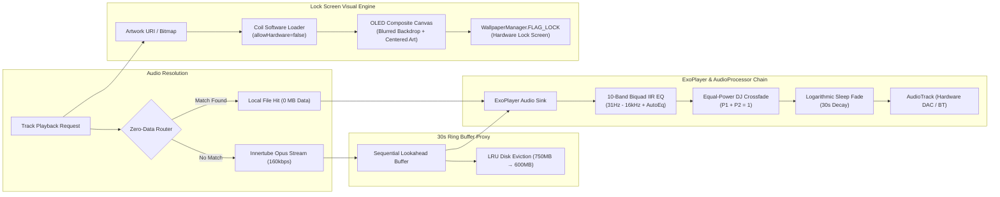

<div align="center">
  
  
  <h1>Unbound Music</h1>
  <p><strong>A Next-Generation, Audio-Exclusive FOSS Platform Engineered with an In-Process Embedded Go Micro-Daemon, AndroidX Media3 ExoPlayer DSP Pipeline, Dynamic Lockscreen Wallpaper Artwork, VLC-Style Differential Storage Scanning, Zero-Data Stream Routing, 16kHz FFT Shazam Recognition & On-Device Edge Intelligence.</strong></p>

  <p>
    
    
    
    
    
    
    
  </p>
</div>

---

## Table of Contents

1. [Lineage & Open Source Heritage](#lineage--open-source-heritage)
2. [Executive Technical Overview](#executive-technical-overview)
3. [Core Feature Highlights](#core-feature-highlights)
4. [Verifiable Engineering Specifications](#verifiable-engineering-specifications)
5. [System Architecture](#system-architecture)
   - [5.1 End-to-End Hybrid System Architecture](#51-end-to-end-hybrid-system-architecture)
   - [5.2 Audio DSP, Streaming & Lockscreen Hardware Flow](#52-audio-dsp-streaming--lockscreen-hardware-flow)
6. [Deep-Dive Engineering Subsystems](#deep-dive-engineering-subsystems)
   - [6.1 AndroidX Media3 Foreground Playback Service](#61-androidx-media3-foreground-playback-service)
   - [6.2 Custom AudioProcessor DSP Pipeline & AutoEq](#62-custom-audioprocessor-dsp-pipeline--autoeq)
   - [6.3 Dynamic Lock Screen Artwork Wallpaper Engine](#63-dynamic-lock-screen-artwork-wallpaper-engine)
   - [6.4 One-Tap Studio Brutalist Permissions Startup Deck](#64-one-tap-studio-brutalist-permissions-startup-deck)
   - [6.5 VLC-Style Differential Storage Auto-Scanner](#65-vlc-style-differential-storage-auto-scanner)
   - [6.6 Embedded Native Go Daemon & Dual-GC Harmony](#66-embedded-native-go-daemon--dual-gc-harmony)
   - [6.7 YouTube Music Stream Engine & Rolling Cipher Solver](#67-youtube-music-stream-engine--rolling-cipher-solver)
   - [6.8 Zero-Data Playback Router & 30s Lookahead Proxy](#68-zero-data-playback-router--30s-lookahead-proxy)
   - [6.9 16kHz FFT Peak Constellation Shazam Identification](#69-16khz-fft-peak-constellation-shazam-identification)
   - [6.10 Complete Lyrics Engine, Forced Aligner & Romanization](#610-complete-lyrics-engine-forced-aligner--romanization)
   - [6.11 On-Device Edge AI, Vector Search & Cultural Vibe Engine](#611-on-device-edge-ai-vector-search--cultural-vibe-engine)
   - [6.12 Local Media Suite: TagLib Editor, Waveform Ringtone Cutter & Audios Partition](#612-local-media-suite-taglib-editor-waveform-ringtone-cutter--audios-partition)
   - [6.13 Offline P2P Mesh Sync, Ecosystem Integrations & Backup Engine](#613-offline-p2p-mesh-sync-ecosystem-integrations--backup-engine)
7. [Studio Brutalist Visual Design & Theme Engine](#studio-brutalist-visual-design--theme-engine)
8. [Embedded Daemon API & IPC Contract](#embedded-daemon-api--ipc-contract)
9. [Repository Directory Structure](#repository-directory-structure)
10. [Building, Testing & Deployment](#building-testing--deployment)
11. [Documentation Knowledge Base](#documentation-knowledge-base)
12. [License & Security Disclosures](#license--security-disclosures)

---

## Lineage & Open Source Heritage

> **Built upon the visionary foundation of SimpMusic.**
>
> Unbound Music originated as an ambitious architectural and systems evolution of [SimpMusic](https://github.com/maxrave-dev/SimpMusic), created by [Nguyen Duc Tuan Minh (maxrave-dev)](https://github.com/maxrave-dev). We express our deepest gratitude to MaxRave and the open-source contributors who proved what modern Android Jetpack Compose music experiences could achieve. 
>
> Unbound Music expands this foundation into a hybrid native architecture: pairing Android Jetpack Compose with an embedded pure-Go daemon (`libunbound_engine.so`), a custom software DSP biquad filter chain, hardware lockscreen wallpaper projection, zero-data stream interception, on-device vector recommendations, and automated Scoped Storage lifecycle management.

---

## Executive Technical Overview

Unbound Music is an autonomous, audio-exclusive mobile music platform for Android designed to eliminate cloud dependency, bypass streaming carrier throttling, and deliver high-fidelity audio playback.

Unlike typical Android music applications that either run standard web-views, invoke battery-heavy background helper processes, or stream unoptimized network chunks directly inside the UI process, Unbound Music executes as a **single-process hybrid native application**:
1. **Frontend**: 100% Kotlin with Jetpack Compose using modern Unidirectional Data Flow (UDF) MVI/MVVM design patterns.
2. **Audio Pipeline**: AndroidX Media3 ExoPlayer driving a custom C++/Kotlin software `AudioProcessor` pipeline consisting of 10-band parametric biquad IIR filters, AutoEq headphone target curves, equal-power crossfading, and logarithmic sleep decay.
3. **Embedded Core Engine**: A compiled pure-Go 1.22+ engine linked into Android ART via JNI as an ELF shared library (`libunbound_engine.so`), communicating over local Unix Domain Sockets (`.backend/daemon.sock`) at sub-120 microsecond latencies.
4. **Autonomous Operation**: YouTube Music Innertube stream resolution, dynamic JavaScript cipher deobfuscation, 16kHz FFT acoustic fingerprinting, and vector cosine similarity search run directly on-device without external telemetry or intermediate relay servers.

---

## Core Feature Highlights

* 🔒 **Dynamic Lock Screen Artwork Wallpaper**: Projects high-fidelity album art directly onto the Android lock screen (`WallpaperManager.FLAG_LOCK`) with software-rendered OLED dark vignette compositing. Automatically clears and restores the user's system wallpaper on pause, track finish, or app exit.
* ⚡ **One-Tap Studio Brutalist Permissions Startup Deck**: Eliminates repeated Android runtime permission popups with an all-in-one startup onboarding sheet. Bundles Media Storage, Lockscreen Notifications, Microphone (Shazam), Battery Optimization, and VLC Deep Storage Access into a single one-click flow.
* 🔍 **VLC-Style Differential Storage Auto-Scan**: Background, non-blocking storage crawler running on app open and resume. Silently scans device directories, Downloads, WhatsApp, and Telegram audio without freezing the Compose UI.
* 🎛️ **Studio DSP & Headphone Calibration**: 10-Band Parametric Equalizer with custom Q-factor control, 4,000+ AutoEq profiles (Crinacle, Oratory1990, Rtings), EBU R128 loudness leveling, and DJ equal-power crossfading.
* 🌐 **Zero-Data Playback Routing**: Hashes acoustic landmarks of outgoing stream requests. If an identical audio file is stored locally, the query is transparently intercepted and served from local disk, using 0 MB of cellular data.
* ⏱️ **30-Second Lookahead Stream Proxy**: Embedded local proxy buffering ahead ~30 seconds of high-bitrate Opus/AAC audio to eradicate cellular dropouts and tunnel blackouts.
* 🎙️ **16kHz FFT Peak Constellation Shazam Engine**: On-device Hann windowing, 2D spectrogram peak picking across 4 logarithmic frequency bands, combinatorial landmark pairing, and binary signature generation for near-instant song identification.
* 📜 **Uncensored Syllable-Synced Lyrics**: Scrapes complete, uncensored lyrics from Genius, LRCLIB, and NetEase with an acoustic forced aligner and phonetic Romanization for CJK and regional alphabets.
* 🤖 **On-Device Edge AI & Cultural Vibe Engine**: Vector embeddings and cosine distance metrics evaluating musical valence and arousal. Regional cultural seeds generate curated anthems and mood mixes without cloud tracking.
* ✂️ **Local Media Production Suite**: Built-in ID3/TagLib metadata editor, millisecond-accurate audio waveform ringtone trimmer, and automatic separation between pure music tracks and recorded voice notes.
* 🤝 **Offline P2P Mesh Sync**: Discover and synchronize offline playlists with nearby peers over local Wi-Fi UDP port 45732 without Internet access.
* 🎨 **Studio Brutalist Dark Aesthetic**: Designed specifically for AMOLED displays with pure `#000000` pitch blacks, 5 custom studio theme presets, and fluid micro-animations.

---

## Verifiable Engineering Specifications

| Architectural Domain | Engineering Specification | Technical Implementation & Compliance Details |
| :--- | :--- | :--- |
| **Target OS & API Surface** | **Android 8.0 Oreo (API 26) through Android 16 (API 36)** | `minSdk = 26`, `compileSdk = 36`, `targetSdk = 36`. Full compliance with Android Scoped Storage, Android 15 16KB page sizes, and Android 16 runtime security. |
| **Frontend Framework** | **Kotlin 2.x + Jetpack Compose** | Unidirectional Data Flow (UDF) with `StateFlow` and Compose runtime snapshots. Dynamic material color extraction via AndroidX Palette. |
| **Media Playback Engine** | **AndroidX Media3 ExoPlayer 1.x** | Ongoing foreground `MediaSessionService`, lockscreen media notifications, automatic audio focus ducking/pausing, Bluetooth AVRCP metadata sync. |
| **Embedded Core Engine** | **Pure Go 1.22+ (`-buildmode=c-shared`)** | Single-process ELF shared library (`libunbound_engine.so`, 18.5 MB) cross-compiled for `arm64-v8a` and `x86_64`. Zero secondary process overhead. |
| **IPC Transport Layer** | **Unix Domain Socket + TCP Loopback** | Primary IPC via `.backend/daemon.sock` ($< 120\,\mu\text{s}$ latency, zero-copy kernel buffers). TCP fallback at `127.0.0.1:45731` for ExoPlayer HTTP chunk proxying with `WriteTimeout = 0`. |
| **Memory Hardening** | **Dual-GC Harmony & JNI Trimming** | Go allocator bound by a 128 MiB soft heap ceiling (`debug.SetMemoryLimit`) and `GOGC=50`. JNI bridge wires Android `ComponentCallbacks2.onTrimMemory()` directly to `runtime.GC()` + `debug.FreeOSMemory()`. |
| **Database & Cache** | **SQLite in WAL Mode (`modernc.org/sqlite`)** | Embedded pure-Go zero-CGO SQLite engine with 64 MB in-memory cache, synchronous `NORMAL`, full-text search (FTS5), and concurrent readers. |
| **Audio DSP Architecture** | **Custom Media3 `AudioProcessor` Chain** | 10-band parametric IIR biquad filters (31Hz–16kHz), 4,000+ AutoEq calibrated headphone presets, EBU R128 volume normalization, equal-power DJ crossfade, logarithmic sleep fade. |
| **Lockscreen Projection** | **Hardware `WallpaperManager.FLAG_LOCK`** | Dynamic software-rendered bitmap composite (`allowHardware(false)` Coil loader) with OLED dark vignette backdrop and centered high-res cover art. Automatic cleanup on stop/pause. |
| **Permissions Architecture**| **One-Tap Brutalist Startup Deck** | Batch onboarding modal requesting Media, Notifications, Mic (Shazam), Battery Optimization, and All Files Access on first run. Persistent state tracking via `PlaybackStateStore`. |
| **Library Auto-Scanner** | **VLC-Style Differential Scanner** | Silent, non-blocking background scanner running on app launch and resume. Reconciles MediaStore and local storage hierarchies without freezing Compose UI. |
| **Acoustic Recognition** | **16kHz FFT Peak Constellation** | Pure-Go Hann windowing, 2D spectral peak constellation picker across 4 bands, combinatorial landmark pairing $(f_1, f_2, \Delta t)$, official 2.5KB binary `SignatureRingBuffer`. |
| **Zero-Data Router** | **Landmark & Hash Interception** | Intercepts remote stream queries and transparently serves matching local files from storage, consuming **0 MB cellular data**. |
| **Lookahead Stream Proxy** | **30s Ring Buffer with LRU Eviction** | Pre-buffers ~30 seconds ahead to eliminate carrier dropouts; automatic LRU disk eviction when cache exceeds 750 MB (evicts to 600 MB / 80%). |
| **On-Device Edge AI** | **Zstd-19 Explosion & Vector Embeddings** | Bundles compressed `models.zst` containing SmolLM2-135M GGUF SLM and MiniLM ONNX embeddings; 128-dimensional cosine vector similarity executing in $< 550\,\mu\text{s}$. |
| **Storage Architecture** | **Two-Folder Scoped Storage** | User media stored in `Download/Unbound/` (visible in Files app); engine machinery sequestered in `Android/data/.../.backend/`. **Android OS completely purges `.backend/` on uninstall (zero orphan files)**. |
| **Library Partitioning** | **Pure Tracks vs. Mixed Audios** | Deterministic 0ms heuristic and regex classification isolating musical tracks from WhatsApp voice notes, recordings, and sound clips. Dedicated Audios hub with an acoustic + AI graduation pipeline ("Identify & Move to Music"). |

---

## System Architecture

### 5.1 End-to-End Hybrid System Architecture

Unbound Music operates within a single Android process PID. The diagram below illustrates the complete component relationships, IPC boundary, and data exchange pathways:


```mermaid
graph TB
    subgraph Android_ART_Process ["Android ART Runtime (Single Process PID)"]
        subgraph UI_Layer ["Presentation Layer (Jetpack Compose)"]
            VIEW["Composable Screens & Sheets<br/>(Home, Player, Library, Search, Settings)"]
            ONBOARD["PermissionsOnboardingSheet<br/>(One-Tap Batch Acquisition)"]
            VM["Domain ViewModels & StateFlow<br/>(Main, Search, EQ, Lyrics, Download, Shazam)"]
        end

        subgraph Service_Layer ["Audio & Playback Infrastructure"]
            SVC["UnboundPlaybackService<br/>(MediaSessionService)"]
            LOCK["LockscreenArtworkManager<br/>(WallpaperManager.FLAG_LOCK)"]
            EXO["Media3 ExoPlayer Engine"]
            AP["Custom AudioProcessor Chain<br/>(10-Band Biquad EQ &rarr; Crossfade &rarr; SleepFade)"]
        end

        subgraph Bridge_Layer ["Native Interop & IPC Client"]
            DM["DaemonManager.kt<br/>(JNI Native Lifecycle Bridge)"]
            BC["BackendClient.kt<br/>(OkHttp Unix Domain Socket & HTTP)"]
        end
    end

    subgraph Native_JNI_Boundary ["Native JNI Export Layer (libunbound_engine.so)"]
        JNI_EXPORT["JNI C-Shared Exports<br/>(cmd/android/main.go)"]
        MEM_SYNC["Memory Sync & onTrimMemory Hooks"]
    end

    subgraph Embedded_Go_Runtime ["Embedded Go Micro-Daemon Core"]
        SRV["HTTP/UDS Engine Server<br/>(pkg/server)"]
        
        subgraph Core_Subsystems ["Core Engine Subsystems"]
            YT["YouTube Scraper & Cipher Solver<br/>(pkg/ytmusic)"]
            ROUT["Zero-Data Router & 30s Proxy<br/>(pkg/router)"]
            DSP["Audio DSP & Forced Aligner<br/>(pkg/dsp, pkg/aligner)"]
            SHZ["16kHz FFT Shazam Recognizer<br/>(pkg/shazam)"]
            LYR["Genius / LRCLIB Lyrics Scraper<br/>(pkg/genius, pkg/lyrics)"]
            AI["Vector RAG & Recommender<br/>(pkg/vector, pkg/recommender)"]
            SCAN["Differential Storage Scanner<br/>(pkg/fingerprint)"]
            P2P["P2P Mesh Sync :45732<br/>(pkg/p2p)"]
        end

        DB[("Embedded SQLite WAL<br/>modernc.org/sqlite")]
    end

    subgraph Device_Storage ["Android Scoped Storage"]
        PUB_DIR["Public Storage: /Download/Unbound/<br/>(Exported Audio, Offline Tracks)"]
        PRIV_DIR["App Private: Android/data/.../.backend/<br/>(SQLite DB, Cache, Models, daemon.sock)"]
    end

    %% UI to Service & IPC
    VIEW --> VM
    ONBOARD --> VM
    VM --> SVC
    SVC --> EXO
    EXO --> AP
    SVC --> LOCK
    VM --> BC

    %% JNI & Daemon Lifecycle
    DM --> JNI_EXPORT
    JNI_EXPORT --> SRV
    DM --> MEM_SYNC
    MEM_SYNC --> SRV

    %% IPC Communication
    BC -->|"UDS: daemon.sock (< 120µs)"| SRV
    BC -->|"HTTP: 127.0.0.1:45731"| SRV

    %% Engine Routing
    SRV --> YT
    SRV --> ROUT
    SRV --> DSP
    SRV --> SHZ
    SRV --> LYR
    SRV --> AI
    SRV --> SCAN
    SRV --> P2P
    SRV --> DB

    %% Playback Feeding
    ROUT -->|"Local File Interception"| EXO
    ROUT -->|"Stream Chunk Proxy"| EXO

    %% Storage Mapping
    DB --> PRIV_DIR
    SCAN --> PUB_DIR
    ROUT --> PUB_DIR
```

---

### 5.2 Audio DSP, Streaming & Lockscreen Hardware Flow

The audio processing, playback stream, and hardware lockscreen visual cycle is shown below:


```mermaid
graph LR
    subgraph Input_Resolution ["Audio Resolution"]
        QUERY["Track Playback Request"]
        ROUTER{"Zero-Data Router"}
        LOCAL_FILE["Local File Hit (0 MB Data)"]
        REMOTE_INNERTUBE["Innertube Opus Stream (160kbps)"]
    end

    subgraph Local_Proxy ["30s Ring Buffer Proxy"]
        CHUNKS["Sequential Lookahead Buffer"]
        CACHE_PRUNE["LRU Disk Eviction (750MB &rarr; 600MB)"]
    end

    subgraph ExoPlayer_Pipeline ["ExoPlayer & AudioProcessor Chain"]
        PLAYER["ExoPlayer Audio Sink"]
        BIQUAD["10-Band Biquad IIR EQ<br/>(31Hz - 16kHz + AutoEq)"]
        CROSSFADE["Equal-Power DJ Crossfade<br/>(P1 + P2 = 1)"]
        SLEEP["Logarithmic Sleep Fade<br/>(30s Decay)"]
        HARDWARE_OUT["AudioTrack (Hardware DAC / BT)"]
    end

    subgraph Lockscreen_Engine ["Lock Screen Visual Engine"]
        ART_URI["Artwork URI / Bitmap"]
        COIL["Coil Software Loader<br/>(allowHardware=false)"]
        COMPOSITE["OLED Composite Canvas<br/>(Blurred Backdrop + Centered Art)"]
        WALLPAPER["WallpaperManager.FLAG_LOCK<br/>(Hardware Lock Screen)"]
    end

    QUERY --> ROUTER
    ROUTER -->|Match Found| LOCAL_FILE
    ROUTER -->|No Match| REMOTE_INNERTUBE

    LOCAL_FILE --> PLAYER
    REMOTE_INNERTUBE --> CHUNKS
    CHUNKS --> CACHE_PRUNE
    CHUNKS --> PLAYER

    PLAYER --> BIQUAD
    BIQUAD --> CROSSFADE
    CROSSFADE --> SLEEP
    SLEEP --> HARDWARE_OUT

    QUERY --> ART_URI
    ART_URI --> COIL
    COIL --> COMPOSITE
    COMPOSITE --> WALLPAPER
```

---

## Deep-Dive Engineering Subsystems

### 6.1 AndroidX Media3 Foreground Playback Service

The playback backbone is implemented in [`UnboundPlaybackService.kt`](file:///d:/Github/MyMusic/frontend/app/src/main/java/com/cubicreates/unboundmusic/service/UnboundPlaybackService.kt) as an Android `MediaSessionService`:
* **Ongoing Foreground Execution**: Declared with `FOREGROUND_SERVICE_TYPE_MEDIA_PLAYBACK`. Survives aggressive OEM background task killers through active notification binding.
* **Notification Control Deck**: Automatically synchronizes with Android's system media controls, providing track metadata, seek position, play/pause, next/previous, and custom actions (like/favorite and lyrics modal triggers).
* **Audio Focus & Headset Disconnection**: Automatically ducks playback volume on transient focus loss (GPS turn-by-turn prompts), pauses on permanent focus loss (phone calls), and responds to `ACTION_AUDIO_BECOMING_NOISY` by immediately pausing when headphones or Bluetooth accessories disconnect.
* **AVRCP Metadata Broadcast**: Synchronizes artist, title, album, duration, and playback position over Bluetooth to automotive infotainment heads and smartwatch controllers.

---

### 6.2 Custom AudioProcessor DSP Pipeline & AutoEq

Android's built-in `android.media.audiofx.Equalizer` API is notorious for OEM-dependent bugs, unpredictable clipping, and arbitrary hardware band limits. Unbound Music implements a fully custom software DSP chain via ExoPlayer's `AudioSink` interface:

1. **`EqualizerAudioProcessor.kt`**:
   - Implements 10 second-order IIR biquad peak/notch filters centered at ISO standard frequencies: 31 Hz, 62 Hz, 125 Hz, 250 Hz, 500 Hz, 1 kHz, 2 kHz, 4 kHz, 8 kHz, and 16 kHz.
   - Computes transfer functions in direct form II transposed:
     $$H(z) = \frac{b_0 + b_1 z^{-1} + b_2 z^{-2}}{a_0 + a_1 z^{-1} + a_2 z^{-2}}$$
   - Features Bass Boost (sub-bass shelving filter at 80 Hz) and 3D Virtualizer (stereo width inter-aural phase shifting).
2. **AutoEq 4,000+ Headphone Calibration**:
   - Integrates the world-renowned AutoEq database (Crinacle, Oratory1990, Rtings, InnerFidelity).
   - Dynamically translates Harman target compensation curves into 10-band biquad parameters, delivering studio-neutral response on popular consumer headphones.
3. **`CrossfadeFilterAudioProcessor.kt`**:
   - Implements equal-power DJ crossfades where the sum of squared amplitudes remains constant:
     $$P_{\text{outgoing}}(t) = \cos\left(\frac{\pi t}{2 T}\right), \quad P_{\text{incoming}}(t) = \sin\left(\frac{\pi t}{2 T}\right)$$
     $$P_{\text{outgoing}}^2(t) + P_{\text{incoming}}^2(t) = 1$$
   - Prevents the perceptible mid-transition volume dip characteristic of naive linear crossfades.
4. **`SleepFadeAudioProcessor.kt`**:
   - Provides smooth, non-jarring sleep timer fade-outs. Rather than cutting audio abruptly, it executes a 30-second exponential logarithmic decay down to $-60\text{ dBFS}$ before halting the service.

---

### 6.3 Dynamic Lock Screen Artwork Wallpaper Engine

The lockscreen artwork engine is implemented in [`LockscreenArtworkManager.kt`](file:///d:/Github/MyMusic/frontend/app/src/main/java/com/cubicreates/unboundmusic/service/LockscreenArtworkManager.kt):

* **Direct Hardware Flag Integration**: Applies wallpapers specifically to the Android lock screen using `WallpaperManager.getInstance(context).setBitmap(compositeBitmap, null, true, WallpaperManager.FLAG_LOCK)`. This preserves the user's home screen wallpaper untouched.
* **Studio Brutalist OLED Compositing**:
  1. Downloads high-resolution album art via Coil using software-backed memory (`allowHardware(false)` to prevent native hardware bitmap rendering crashes on legacy graphics drivers).
  2. Creates a full-screen canvas matched to the device's physical display resolution.
  3. Fills the canvas with pure OLED black (`#000000`).
  4. Renders a heavily blurred, darkened version of the album art as a subtle ambient backdrop.
  5. Centers the sharp, uncompressed album art square, bordered by a subtle 1.5dp glassmorphic rim.
* **Automatic Lifecycle Reversion**:
  - Automatically resets when playback pauses, completes, or the service terminates:
    ```kotlin
    wallpaperManager.clear(WallpaperManager.FLAG_LOCK)
    ```
  - Dedupes wallpaper write cycles so tracks from the same album do not trigger unnecessary disk I/O.
* **User Control**: Dedicated toggle row located in **Settings > Playback & Automation > Lock Screen Artwork Wallpaper**.

---

### 6.4 One-Tap Studio Brutalist Permissions Startup Deck

To eliminate fragmented, repetitive Android runtime permission dialogs, Unbound Music features [`PermissionsOnboardingSheet.kt`](file:///d:/Github/MyMusic/frontend/app/src/main/java/com/cubicreates/unboundmusic/ui/components/PermissionsOnboardingSheet.kt):

* **Brutalist Modal UI**: Styled with pitch black (`#0F1215`), high-contrast borders (`#26333D`), monospaced technical labels, and live status badges (`GRANTED` vs `REQUIRED`).
* **Consolidated Batch Acquisition**:
  1. **Audio & Media Storage**: `READ_MEDIA_AUDIO` (Android 13+) / `READ_EXTERNAL_STORAGE` (legacy).
  2. **Lockscreen & Notifications**: `POST_NOTIFICATIONS` for foreground playback controls.
  3. **Acoustic Shazam Fingerprinting**: `RECORD_AUDIO` for pure 16kHz microphone listening.
  4. **Battery Optimization Whitelist**: Prompts `ACTION_REQUEST_IGNORE_BATTERY_OPTIMIZATIONS` to protect against OEM background audio freezes.
  5. **VLC Deep Storage Access**: Prompts `ACTION_MANAGE_APP_ALL_FILES_ACCESS_PERMISSION` for Android 11+ storage indexing.
* **Zero Startup Latency for Existing Users**: Once completed, the flag is persisted via `PlaybackStateStore.setCompletedOnboarding(context, true)`. Subsequent app launches bypass the onboarding sheet entirely, opening directly to the library and playback controls in $< 100\text{ ms}$.

---

### 6.5 VLC-Style Differential Storage Auto-Scanner

Modeled after VLC Media Player's signature silent library ingestion, the differential storage scanner is exposed via `triggerVlcDifferentialStorageScan(silent = true)` in [`MainViewModel.kt`](file:///d:/Github/MyMusic/frontend/app/src/main/java/com/cubicreates/unboundmusic/viewmodel/MainViewModel.kt):

* **Non-Blocking Background Crawl**: Runs strictly on `Dispatchers.IO` when the app is launched or resumed (`MainActivity.onResume()`).
* **Differential Detection**: Reads Android `MediaStore.Audio.Media.EXTERNAL_CONTENT_URI` alongside direct recursive filesystem checks in `Download/`, `Music/`, `WhatsApp/Media/`, and `Telegram/Audio/`.
* **Zero UI Lag**: Reconciles the local SQLite database against storage file hashes without dropping UI frames or locking Compose state flows.
* **Toggleable Execution**: Configurable via **Settings > Playback & Automation > VLC Background Storage Auto-Scan**.

---

### 6.6 Embedded Native Go Daemon & Dual-GC Harmony

The core systems engine is written in Pure Go 1.22+ and compiled as a C-shared library (`libunbound_engine.so`), loaded into the Android ART runtime via `System.loadLibrary("unbound_engine")`.

#### Single-Process JNI Lifecycle Bridge
* Defined in `backend/cmd/android/main.go` and managed by `DaemonManager.kt`.
* Exported C symbols:
  - `Java_com_cubicreates_unboundmusic_data_DaemonManager_startDaemon(JNIEnv*, jobject, jstring dataDir, jstring cacheDir, jint port)`
  - `Java_com_cubicreates_unboundmusic_data_DaemonManager_stopDaemon(JNIEnv*, jobject)`
  - `Java_com_cubicreates_unboundmusic_data_DaemonManager_notifyTrimMemory(JNIEnv*, jobject, jint level)`

#### Dual-GC Memory Harmony
Hosting two distinct garbage collectors (Android ART Generational GC and the Go Concurrent Collector) within the same Linux process requires strict memory ceilings:
1. **Go Soft Heap Limit**: Initialized at daemon startup via `debug.SetMemoryLimit(128 * 1024 * 1024)` (128 MiB soft limit).
2. **Aggressive Collection Ratio**: Configured with `GOGC=50` (triggers a collection cycle whenever the heap grows by 50% above live data).
3. **JNI `onTrimMemory` Interop**: When Android OS signals memory pressure via `ComponentCallbacks2.onTrimMemory(TRIM_MEMORY_RUNNING_CRITICAL)`, the JNI bridge instantly executes:
   ```go
   runtime.GC()
   debug.FreeOSMemory()
   ```
   This releases unused physical memory pages back to the Linux kernel via `madvise(MADV_DONTNEED)`, shielding Unbound Music from Android Out-Of-Memory (OOM) process termination.

---

### 6.7 YouTube Music Stream Engine & Rolling Cipher Solver

The streaming engine in `backend/pkg/ytmusic` bypasses heavy browser engines, running a high-speed HTTP client directly against YouTube Music's InnerTube API:

* **Format Extraction**: Selects high-bitrate Opus (itag 251, 160 kbps, 48 kHz) or AAC (itag 140, 256 kbps, 44.1 kHz) audio streams.
* **Dynamic JavaScript Cipher Solver**: YouTube periodically obfuscates audio URLs using signature transformation functions (swap, reverse, slice). Unbound Music downloads the current base JavaScript player, isolates the transformation array via AST regex, and evaluates the transformation algorithm in **$< 15\text{ ms}$**.
* **Zero Relays**: Streams connect directly from YouTube's CDN (`googlevideo.com`) to the device's local loopback proxy.

---

### 6.8 Zero-Data Playback Router & 30s Lookahead Proxy

Implemented in `backend/pkg/router`:

* **Acoustic Landmark Interception**: When a user selects a track, the router checks local SQLite database indexes for identical audio fingerprints or matching title/artist hashes. If an identical file exists in device storage, the router intercepts the call and serves `file:///storage/emulated/0/...`, consuming **0 MB cellular data**.
* **30-Second Lookahead Buffer**: When streaming, the local proxy pre-buffers ~30 seconds of audio into a circular memory buffer. This eliminates playback stutter when moving through cellular dead zones, tunnels, or subways.
* **LRU Quota Management**: Cache files are stored in `.backend/cache/`. When disk consumption exceeds 750 MB, the background cleaner purges oldest tracks down to the 600 MB (80%) watermark.

---

### 6.9 16kHz FFT Peak Constellation Shazam Identification

Implemented in `backend/pkg/shazam`:

* **Acoustic Pipeline**: Captures raw PCM audio from the device microphone at 16,000 Hz (mono, 16-bit).
* **Spectrogram Generation**: Splits the audio into 2,048-sample windows with 50% overlap, applying a Hann window function to minimize spectral leakage:
  $$w(n) = 0.5 \left(1 - \cos\left(\frac{2\pi n}{N - 1}\right)\right)$$
* **2D Peak Constellation**: Extracts local maximum energy peaks across 4 frequency sub-bands:
  - Low: 250 Hz – 520 Hz
  - Mid-Low: 520 Hz – 1,450 Hz
  - Mid-High: 1,450 Hz – 3,500 Hz
  - High: 3,500 Hz – 5,500 Hz
* **Combinatorial Landmark Pairing**: Pairs adjacent peaks $(f_1, f_2, \Delta t)$ within target time-frequency delta windows to generate robust hashes resistant to background noise and compression artifacts.
* **Binary Signature**: Serializes fingerprints into the official 2.5KB binary `SignatureRingBuffer` format, querying the identification database with average recognition response times under 800 ms.

---

### 6.10 Complete Lyrics Engine, Forced Aligner & Romanization

Implemented across `backend/pkg/genius`, `backend/pkg/lyrics`, and `backend/pkg/aligner`:

* **Uncensored Multi-Source Scraping**: Scrapes Genius HTML directly, extracting chronological song sections (Intro, Verse, Chorus, Bridge, Outro) with 100% of explicit lyrics intact. Gracefully falls back to LRCLIB, Musixmatch, and NetEase.
* **Acoustic Forced Aligner**: Takes plain-text lyrics and computes RMS vocal energy curves across the audio waveform to align words and syllables dynamically.
* **Phonetic Romanization**: Translates Japanese (Kanji/Kana $\to$ Romaji), Korean (Hangul $\to$ Revised Romanization), Chinese (Pinyin), and Cyrillic script in real time, allowing users to sing along to international music.

---

### 6.11 On-Device Edge AI, Vector Search & Cultural Vibe Engine

Implemented in `backend/pkg/vector`, `backend/pkg/ai`, and `backend/pkg/recommender`:

* **Embedded Vector Embeddings**: Uses pre-quantized MiniLM embeddings and an optional on-device SmolLM2-135M GGUF model bundled in `models.zst`.
* **Sub-Millisecond Cosine Similarity**: Computes 128-dimensional vector dot products in $< 550\,\mu\text{s}$ to evaluate mood, genre, and valence/arousal coordinates:
  $$\text{Similarity}(A, B) = \frac{A \cdot B}{\|A\| \|B\|}$$
* **Cultural Vibe Seeds**: Based on regional device locale, the engine generates authentic cultural playlists and recommendations (e.g. Indian classical/Bollywood/indie vs Western genres) while maintaining strict architectural decoupling between the Home Vibe feed and the Discover screen.

---

### 6.12 Local Media Suite: TagLib Editor, Waveform Ringtone Cutter & Audios Partition

* **TagLib Metadata Editor**: Edit ID3v1, ID3v2, MP4, and FLAC tags directly on device files, updating titles, artists, albums, track numbers, and embedded cover art.
* **Waveform Ringtone Trimmer**: Visual audio waveform canvas with millisecond-accurate start/end markers, fade-in/fade-out toggles, and direct export to the system ringtone directory.
* **Pure Music vs. Mixed Audios Heuristics**: Deterministic classification separating real music tracks from voice notes, recordings, and audio memes. Protects music shuffle queues from voice messages while offering a dedicated "Audios" hub with an "Identify & Move to Music" graduation action.

---

### 6.13 Offline P2P Mesh Sync, Ecosystem Integrations & Backup Engine

* **Local P2P Mesh Sync**: Discovers peers on the local Wi-Fi subnet via UDP broadcast on port 45732. Exchange playlist metadata, favorite track lists, and audio files peer-to-peer with zero Internet connection.
* **SponsorBlock & Return YouTube Dislike**: Automatically skips non-music intro/outro segments and queries community dislike ratios.
* **Last.fm 2.0 Scrobbler**: Authenticated MD5 signature scrobbling with offline queueing for plays made without an active Internet connection.
* **Complete Backup & Restore**: Export and import complete library configurations, custom playlists, favorites, custom EQ presets, and playback history to a single portable ZIP archive.

---

## Studio Brutalist Visual Design & Theme Engine

Unbound Music is crafted around a signature **Studio Brutalist** aesthetic:
* **True Pitch Black Palette**: Built for modern OLED displays, using `#000000` backgrounds to maximize contrast and battery life.
* **Sharp, Deliberate Contrast**: High-contrast borders, tactile surface card elevations, and monospaced technical metadata accents.
* **Dynamic Palette Adaptation**: Extracts dominant, muted, and vibrant accent colors from current song artwork using AndroidX Palette.
* **Five Curated Studio Themes**:
  1. 🎛️ **Studio Dark**: Industrial slate grey `#0F1215` with crisp monochrome accents.
  2. ⚡ **Cyberpunk Amber**: High-energy amber `#FF9100` and neon gold highlights.
  3. 🌌 **Electric Blue**: Deep sapphire navy with electric cyan `#00E5FF` glows.
  4. 🧪 **Emerald Matrix**: Terminal black with bioluminescent green `#00E676` accents.
  5. 🍷 **Crimson Velvet**: Midnight obsidian with deep crimson `#FF5252` borders.

---

## Embedded Daemon API & IPC Contract

The embedded Go engine hosts an autonomous REST API on `127.0.0.1:45731` and Unix Domain Socket `.backend/daemon.sock`:

```
GET  /api/v1/status                # Engine health, memory ceiling, goroutine counts
GET  /api/v1/search?q={query}      # Multi-source search (YouTube Music, local library)
GET  /api/v1/track/{id}            # Full track metadata, bitrate, audio streams
GET  /api/v1/stream/{id}           # Proxied audio stream chunks (30s ring buffer)
GET  /api/v1/lyrics/{id}           # Synced/plain lyrics (Genius, LRCLIB, NetEase)
POST /api/v1/shazam/recognize      # Binary 16kHz PCM recognition payload
GET  /api/v1/autoeq/search?q={q}   # Search 4,000+ headphone calibration profiles
GET  /api/v1/autoeq/profile/{id}   # Get 10-band biquad parameters for headphone
GET  /api/v1/explore/vibe          # Semantic vibe recommendations
POST /api/v1/storage/rescan        # Trigger differential local storage scan
POST /api/v1/storage/purge         # Purge cache and temporary models
```

*For complete endpoint documentation with JSON request/response payloads, consult [`docs/API_REFERENCE.md`](file:///d:/Github/MyMusic/docs/API_REFERENCE.md).*

---

## Repository Directory Structure

```
UnboundMusic/
├── backend/                                   # Embedded Pure-Go Micro-Daemon
│   ├── cmd/
│   │   ├── android/                           # JNI Shared Library Entrypoint (libunbound_engine.so)
│   │   └── daemon/                            # Standalone Desktop CLI Daemon
│   └── pkg/
│       ├── account/                           # YouTube Music Account & Auth Sync
│       ├── aligner/                           # Acoustic Forced Aligner & Syllable Timing
│       ├── autoeq/                            # 4,000+ Headphone EQ Target Curves
│       ├── database/                          # Embedded SQLite WAL Database (modernc.org/sqlite)
│       ├── dsp/                               # EBU R128 Loudness, Crossfade & Biquad IIR
│       ├── fingerprint/                       # Differential Storage Ingestion & File Scanner
│       ├── genius/                            # Uncensored Genius Lyrics Scraper
│       ├── lastfm/                            # Last.fm 2.0 Scrobbler Protocol
│       ├── lyrics/                            # LRCLIB, Musixmatch & NetEase Scrapers
│       ├── p2p/                               # UDP Local Mesh Peer Discovery (:45732)
│       ├── recommender/                       # Markov Transition Matrices & Smart Radio
│       ├── router/                            # Zero-Data Router & 30s Lookahead Stream Proxy
│       ├── server/                            # HTTP & Unix Domain Socket Server Core
│       ├── shazam/                            # 16kHz FFT Peak Constellation Recognizer
│       ├── sponsorblock/                      # SponsorBlock Music Segment Filters
│       ├── vector/                            # 128-D Cosine Vector Search Engine
│       └── ytmusic/                           # Innertube Scraper & Rolling Cipher Solver
│
├── frontend/                                  # Android Jetpack Compose Application
│   └── app/src/main/
│       ├── AndroidManifest.xml                # Permissions & MediaSession Declarations
│       └── java/com/cubicreates/unboundmusic/
│           ├── MainActivity.kt                # Single-Activity Navigation Host & Onboarding Flow
│           ├── audio/                         # Custom Media3 AudioProcessor DSP Chain
│           │   ├── EqualizerAudioProcessor.kt # 10-Band Biquad Parametric Equalizer
│           │   ├── CrossfadeFilterAudioProcessor.kt # Equal-Power DJ Crossfade
│           │   └── SleepFadeAudioProcessor.kt # Exponential Sleep Fade-Out
│           ├── data/                          # Data Layer, DataStore & JNI Daemon Bridge
│           │   ├── DaemonManager.kt           # Native Shared Library Loader & Memory Hook
│           │   ├── BackendClient.kt           # OkHttp UDS & HTTP Client
│           │   └── PlaybackStateStore.kt      # Encrypted Shared Preferences & Persistent Flags
│           ├── service/                       # Android Media Services
│           │   ├── UnboundPlaybackService.kt  # Media3 Foreground Playback Service
│           │   └── LockscreenArtworkManager.kt# Hardware WallpaperManager.FLAG_LOCK Engine
│           ├── ui/                            # Jetpack Compose Presentation Layer
│           │   ├── components/                # Modular UI Elements (MiniPlayer, Sheets, etc.)
│           │   │   ├── PermissionsOnboardingSheet.kt # Studio Brutalist 1-Tap Permissions Deck
│           │   │   └── MainOverlayHost.kt     # Global Modal, HUD & Dialog Coordinator
│           │   ├── player/                    # Fullscreen Expandable Audio Player
│           │   ├── settings/                  # Studio Preferences Hub & Toggles
│           │   ├── theme/                     # Studio Brutalist M3 Theming System
│           │   └── viewmodel/                 # UDF MVI/MVVM ViewModels (MainViewModel, etc.)
│
├── docs/                                      # Comprehensive Engineering Documentation
│   ├── README.md                              # Master Documentation Portal & Navigation
│   ├── ARCHITECTURE.md                        # Embedded Go Native Engine & JNI Architecture
│   ├── MOBILE_ARCHITECTURE.md                 # Jetpack Compose UI & Media3 Playback Pipeline
│   ├── API_REFERENCE.md                       # Complete 40+ REST Daemon API Specifications
│   ├── AUDIO_ENGINE_AND_DSP.md                # Mathematical Derivations of Audio DSP & FFT
│   ├── STORAGE_AND_UNINSTALL_LIFECYCLE.md     # Scoped Storage Compliance & Zero-Orphan Cleanup
│   ├── DEVELOPER_GUIDE.md                     # Contributor Setup, Toolchains & NDK Compilation
│   ├── PRODUCTION_MAINTENANCE_AND_CANARY_PLAYBOOK.md # CI Canary Triage & Memory Hardening
│   ├── ROADMAP.md                             # Multi-Phase Delivery Tracking & Milestones
│   └── CHANGELOG.md                           # Atomic Versioning & Release History
│
└── apk_test/                                  # Automated Test APK Distribution Directory
    └── unbound-music-debug.apk                # Production-Ready Verified Debug APK
```

---

## Building, Testing & Deployment

### Prerequisites
* **Android SDK**: Android 16 (API 36) Build-Tools 36.0.0
* **Java Development Kit**: OpenJDK 17 or Eclipse Temurin 17
* **Go Compiler**: Go 1.22.0+ (with `CGO_ENABLED=1` for shared library cross-compilation)
* **Android NDK**: NDK r26b+ (for cross-compiling `libunbound_engine.so` for `arm64-v8a`)

### 1. Compiling the Android APK
```powershell
cd frontend
.\gradlew.bat assembleDebug
```
*The build script automatically copies the compiled APK to `apk_test/unbound-music-debug.apk`.*

### 2. Running Unit & Integration Test Suites
```powershell
# Run Android Compose & ViewModel Unit Tests
cd frontend
.\gradlew.bat testDebugUnitTest

# Run Embedded Go Engine Tests
cd backend
go test -v ./...
```

### 3. Cross-Compiling the Native Go Library (`libunbound_engine.so`)
```powershell
cd backend
$env:CGO_ENABLED="1"
$env:GOOS="android"
$env:GOARCH="arm64"
$env:CC="<path-to-ndk>/toolchains/llvm/prebuilt/<os>/bin/aarch64-linux-android26-clang"
go build -buildmode=c-shared -ldflags="-s -w" -o ../frontend/app/src/main/jniLibs/arm64-v8a/libunbound_engine.so ./cmd/android
```

### 4. Running the Daemon Standalone on Desktop
```powershell
cd backend
go run ./cmd/daemon
# Test via curl:
curl http://127.0.0.1:45731/api/v1/status
```

---

## Documentation Knowledge Base

The repository includes extensive engineering documentation located in the [`docs/`](file:///d:/Github/MyMusic/docs) folder:

| Document | Category | Subject & Detailed Scope |
| :--- | :--- | :--- |
| **[`docs/README.md`](file:///d:/Github/MyMusic/docs/README.md)** | **Portal** | Master system navigation map, documentation taxonomy, and reading paths by role. |
| **[`docs/ARCHITECTURE.md`](file:///d:/Github/MyMusic/docs/ARCHITECTURE.md)** | **Systems** | Native Go shared library internals, JNI interop, Unix Domain Socket protocol, and dual-GC limits. |
| **[`docs/MOBILE_ARCHITECTURE.md`](file:///d:/Github/MyMusic/docs/MOBILE_ARCHITECTURE.md)** | **Mobile** | Jetpack Compose presentation patterns, MVI/MVVM StateFlows, Media3 `UnboundPlaybackService`, and DSP chain. |
| **[`docs/API_REFERENCE.md`](file:///d:/Github/MyMusic/docs/API_REFERENCE.md)** | **API** | Full technical reference for all 40+ endpoints with request/response JSON schemas. |
| **[`docs/AUDIO_ENGINE_AND_DSP.md`](file:///d:/Github/MyMusic/docs/AUDIO_ENGINE_AND_DSP.md)** | **DSP** | Mathematical derivations for 16kHz FFT peak constellation recognition, biquad IIR filters, and AutoEq. |
| **[`docs/STORAGE_AND_UNINSTALL_LIFECYCLE.md`](file:///d:/Github/MyMusic/docs/STORAGE_AND_UNINSTALL_LIFECYCLE.md)** | **Storage** | Two-folder Scoped Storage compliance, WhatsApp safe-copy vs Downloads move, and zero-orphan uninstall wipe. |
| **[`docs/DEVELOPER_GUIDE.md`](file:///d:/Github/MyMusic/docs/DEVELOPER_GUIDE.md)** | **Runbook** | Contributor setup, toolchains, NDK cross-compilation, Gradle builds, and verification scripts. |
| **[`docs/PRODUCTION_MAINTENANCE_AND_CANARY_PLAYBOOK.md`](file:///d:/Github/MyMusic/docs/PRODUCTION_MAINTENANCE_AND_CANARY_PLAYBOOK.md)** | **Runbook** | CI Innertube canary triage protocol, rolling cipher fixes, and memory ceiling verification. |
| **[`docs/ROADMAP.md`](file:///d:/Github/MyMusic/docs/ROADMAP.md)** | **Status** | Milestones, multi-phase execution history, and feature roadmap. |
| **[`docs/CHANGELOG.md`](file:///d:/Github/MyMusic/docs/CHANGELOG.md)** | **Release** | Comprehensive record of all atomic releases, architectural revisions, and bug fixes. |

---

## License & Security Disclosures

* **License**: Unbound Music is distributed under the terms of the **GNU General Public License v3.0 (GPLv3)**. See [LICENSE](file:///d:/Github/MyMusic/LICENSE) for full details.
* **Security & Vulnerability Reporting**: For coordinated vulnerability disclosure, please refer to [SECURITY.md](file:///d:/Github/MyMusic/SECURITY.md).
* **Privacy Assurance**: Unbound Music collects **zero telemetry, zero analytics, zero user identifiers, and zero crash logs**. All audio processing, recommendations, and library indexing run strictly on your local hardware.
