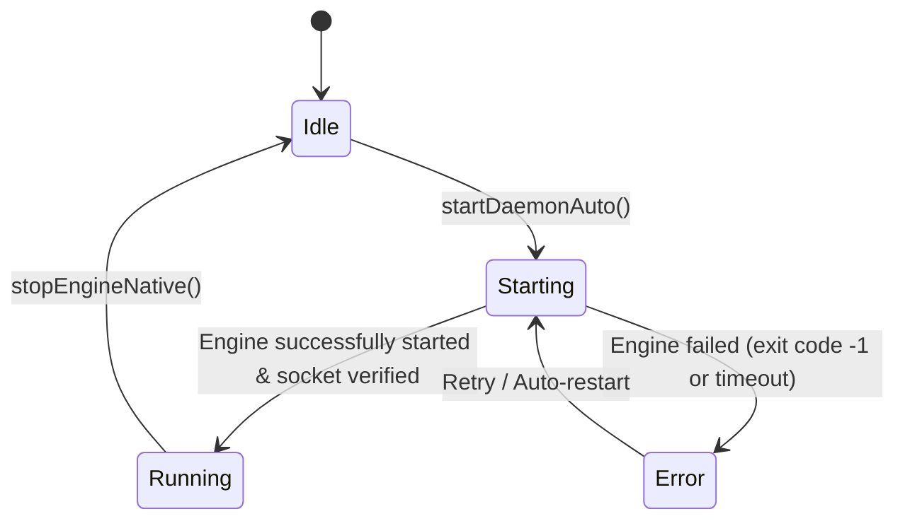
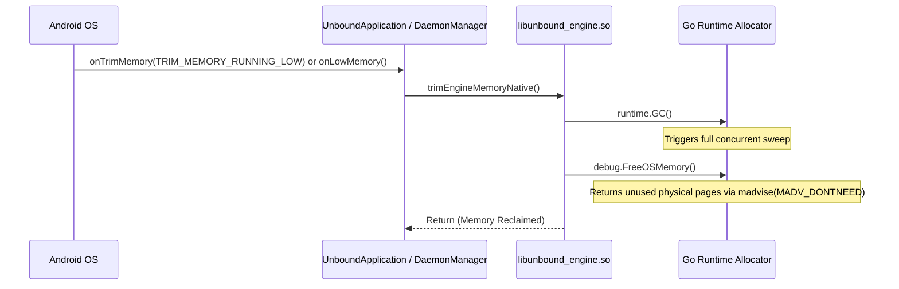
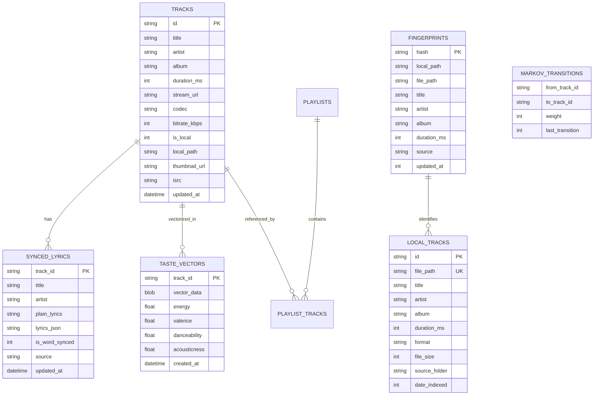

# Unbound Music - System Architecture & Embedded Engine Mechanics

This document provides a comprehensive, authoritative technical specification of Unbound Music's hybrid systems architecture. It covers the dual-runtime execution environment (Android ART + Native Go Runtime), inter-process communication (IPC), memory management and dual-GC harmony, concurrency and panic containment, and database topology.

---

## 1. High-Level System Topology

Unbound Music couples a modern Android frontend (Kotlin + Jetpack Compose + AndroidX Media3 ExoPlayer) with an embedded, native Go micro-daemon (`libunbound_engine.so`). Both run within a **single Android OS process**, eliminating the memory and IPC overhead of cross-process Android services while granting the player direct access to high-performance Go networking, scraping, DSP, and SQLite routines.

```mermaid
graph TB
    subgraph Android ART VM [Android ART Runtime (PID: App)]
        UI[Jetpack Compose UI\n(Material 3 / Dynamic Theming)]
        VM[Architecture ViewModels\n(StateFlow / MVI-MVVM)]
        SVC[UnboundPlaybackService\n(MediaSessionService + ExoPlayer)]
        AP[AudioProcessor Pipeline\n(10-Band EQ / Crossfade / Sleep)]
        DM[DaemonManager.kt\n(Lifecycle & Memory Hooks)]
        BC[BackendClient.kt\n(OkHttp Client)]
        
        UI --> VM
        VM --> SVC
        SVC --> AP
        VM --> BC
        DM -.->|JNI Lifecycle| JNI[JNI Export Layer\n(cmd/android/main.go)]
    end

    subgraph Native JNI Boundary [libunbound_engine.so (C-Shared Library)]
        JNI -->|CGo Bridge| GO_INIT[Engine Startup & Mem Config]
    end

    subgraph Embedded Go Runtime [Go 1.22+ Runtime (In-Process)]
        GO_INIT --> SRV[HTTP/UDS Engine Server\n(pkg/server)]
        
        subgraph Core Subsystems
            YT[YouTube Scraper & Cipher\n(pkg/ytmusic)]
            GEN[Genius / LRCLIB Lyrics\n(pkg/genius, pkg/lyrics)]
            DSP[Audio DSP & Aligner\n(pkg/aligner, pkg/dsp)]
            SHZ[Shazam 16kHz Recognizer\n(pkg/shazam)]
            ROUT[Zero-Data Router & Proxy\n(pkg/router)]
            VEC[Vector Engine & Recommender\n(pkg/vector, pkg/recommender)]
            AUTO[AutoEq 4000+ Database\n(pkg/autoeq)]
            P2P[P2P UDP Mesh :45732\n(pkg/p2p)]
        end

        SRV --> YT
        SRV --> GEN
        SRV --> DSP
        SRV --> SHZ
        SRV --> ROUT
        SRV --> VEC
        SRV --> AUTO
        SRV --> P2P

        DB[(SQLite WAL Database\nmodernc.org/sqlite\npkg/database)]
        SRV --> DB
    end

    BC -->|Unix Domain Socket: daemon.sock\n(Fallback: TCP 127.0.0.1:45731)| SRV
    ROUT -->|Local Track Hit: file://| SVC
    ROUT -->|Stream Buffer: http://proxy| SVC
    
    subgraph Storage Subsystem [Filesystem Storage]
        PUB[/storage/emulated/0/Download/Unbound/\n(User-Facing Music & Downloads)]
        PRIV[/storage/emulated/0/Android/data/.../.backend/\n(SQLite DB, Models, Caches, Socket)]
    end

    DB --> PRIV
    ROUT --> PUB
```

---

## 2. Dual-Runtime Lifecycle Orchestration

### 2.1 Native Library Loading (`libunbound_engine.so`)
The native engine is compiled as an ELF shared object (`-buildmode=c-shared`) using the Android NDK for targets `arm64-v8a` and `x86_64`.

1. **JNI Pre-loading**: In `UnboundApplication.onCreate()`, the application initializes core caches and prepares storage. `DaemonManager` then triggers dynamic linking:
   ```kotlin
   System.loadLibrary("unbound_engine")
   ```
2. **Exported JNI Signatures**: `backend/cmd/android/main.go` exports three native C symbols using CGo:
   - `Java_com_cubicreates_unboundmusic_daemon_DaemonManager_startEngineNative(env, clazz, jAppStoragePath, jPort)`
   - `Java_com_cubicreates_unboundmusic_daemon_DaemonManager_stopEngineNative(env, clazz)`
   - `Java_com_cubicreates_unboundmusic_daemon_DaemonManager_trimEngineMemoryNative(env, clazz)`

### 2.2 DaemonManager Lifecycle State Machine
`DaemonManager.kt` maintains a thread-safe singleton state machine exposed via Kotlin `StateFlow<DaemonLifecycleState>`:



* **Idle**: Native library loaded, daemon not active.
* **Starting**: Launching native goroutine server, probing `/api/v1/status`.
* **Running**: UDS listener and HTTP listener active, endpoints responsive.
* **Error**: Startup error captured, automatic exponential-backoff retry triggered.

---

## 3. Inter-Process Communication (IPC) Mechanics

Rather than relying on heavyweight Android Binder transactions or high-overhead HTTP across the network card, communication between the Android Kotlin client and the embedded Go engine is architectured for ultra-low latency and high data throughput.

### 3.1 Dual-Transport Mechanism: UDS + TCP Loopback

| Transport Layer | Channel Location | Use Case | Latency | Overhead |
| :--- | :--- | :--- | :--- | :--- |
| **Unix Domain Socket (Primary)** | `.backend/daemon.sock` | On-device API requests, telemetry, search, lyrics | $< 120\,\mu\text{s}$ | Zero-copy OS buffer, bypasses network stack |
| **TCP Loopback (Fallback & Media)**| `127.0.0.1:45731` | ExoPlayer HTTP audio streaming & proxy requests | $\sim 450\,\mu\text{s}$ | Standard IP loopback |

1. **Unix Domain Socket (UDS)**:
   - Created in the app's internal backend directory: `context.getExternalFilesDir(null)/.backend/daemon.sock`.
   - File permissions restricted to the application UID (0755/0700).
   - Android client uses a custom `OkHttpClient` configured with a custom socket factory connecting directly to the AF_UNIX file descriptor.
2. **TCP Loopback Fallback**:
   - `net.Listen("tcp", "127.0.0.1:45731")` runs concurrently.
   - Used by AndroidX ExoPlayer data sources (`OkHttpDataSource` / `DefaultHttpDataSource`) which expect standard `http://` URIs for streaming chunks.

### 3.2 Infinite WriteTimeout for Audio Streaming
Standard Go HTTP servers enforce a `WriteTimeout` (e.g. 15–30 seconds). In Unbound Music, the proxy streaming endpoint `/api/v1/proxy/stream` streams live audio to ExoPlayer for the entire duration of a song (up to 10–20 minutes for live mixes).
- **Configuration**:
  ```go
  s.httpServer = &http.Server{
      Addr:         fmt.Sprintf("127.0.0.1:%d", cfg.Port),
      Handler:      RecoveryMiddleware(corsMiddleware(mux)),
      ReadTimeout:  60 * time.Second,
      WriteTimeout: 0, // Explicitly 0: allows long-lived audio streaming connections
  }
  ```

---

## 4. Memory Hardening & Dual-GC Harmony

Hosting the Go runtime inside an Android ART process introduces **dual-GC contention**:
* The Android ART VM manages Java/Kotlin objects with a generational concurrent mark-sweep garbage collector.
* The Go runtime manages Go allocations with its own concurrent tri-color mark-sweep garbage collector.
* Left unconstrained, the Go runtime can allocate heap until the Android OS kernel LMK (Low Memory Killer) terminates the entire app process.

### 4.1 Memory Boundaries & Soft Ceiling
At startup (`server.ConfigureMemoryCeiling()`), the engine establishes strict boundaries:

1. **Soft Memory Ceiling**:
   ```go
   debug.SetMemoryLimit(128 * 1024 * 1024) // 128 MiB soft heap ceiling
   ```
   Tells the Go 1.19+ allocator to aggressively return memory to the OS as heap usage nears 128 MiB.
2. **Aggressive Collection Ratio**:
   ```go
   debug.SetGCPercent(50)
   ```
   Triggers Go garbage collection when heap growth reaches 50% (compared to Go's default 100%), preventing memory spikes during heavy stream proxying and 16kHz FFT audio recognition.

### 4.2 Native Memory Trimming Protocol
`DaemonManager.kt` hooks into Android OS system memory events:



---

## 5. Concurrency, Goroutine Safety & Panic Containment

### 5.1 SafeGoroutine Pattern (`SafeGo`)
Uncontrolled goroutines that panic will crash the entire Linux process, killing the Android app without an Android exception trace. To guarantee 100% resilience:
* All background tasks (P2P UDP discovery, background indexing, download workers, periodic cleanup) are spawned via `server.SafeGo`:
  ```go
  func SafeGo(name string, fn func()) {
      go func() {
          defer func() {
              if r := recover(); r != nil {
                  buf := make([]byte, 4096)
                  n := runtime.Stack(buf, false)
                  log.Printf("[PANIC RECOVER] Goroutine '%s': %v\nStack:\n%s", name, r, string(buf[:n]))
              }
          }()
          fn()
      }()
  }
  ```

### 5.2 HTTP Recovery Middleware
Every incoming HTTP and UDS request passes through `RecoveryMiddleware`:
* Catches unexpected slice panics, JSON decoding faults, or regex issues.
* Returns HTTP `500 Internal Server Error` with JSON error details to the Kotlin client instead of aborting the host process.

---

## 6. Database & Persistence Topology

Unbound Music employs a zero-CGO, embedded SQLite database (`modernc.org/sqlite`) running in **WAL (Write-Ahead Logging)** mode.

### 6.1 Database Configuration & Performance Tuning
```sql
PRAGMA journal_mode = WAL;
PRAGMA synchronous = NORMAL;
PRAGMA temp_store = MEMORY;
PRAGMA cache_size = -64000; -- 64MB cache
PRAGMA foreign_keys = ON;
```
* **WAL Mode**: Allows concurrent readers while a background writer writes indexes or logs analytics. Readers never block writers; writers never block readers.
* **Synchronous NORMAL**: Eliminates unnecessary disk sync calls on every transaction while maintaining zero database corruption risk in WAL mode across crashes.

### 6.2 Key Tables and Relational Map



---

## 7. Security Boundaries & Threat Modeling

1. **Localhost Binding Only**:
   - The Go HTTP daemon strictly binds to `127.0.0.1`. It never binds to `0.0.0.0` or public network interfaces.
   - P2P Wi-Fi mesh sync binds exclusively to UDP port `45732` for local network broadcast peer discovery and catalog diff exchange.
2. **Android Scoped Storage Compliance**:
   - The app interacts with public audio via the MediaStore API and standard directory paths (`Download/Unbound/`).
   - App machinery (models, databases, sockets, logs) is strictly sequestered inside `getExternalFilesDir(null)/.backend/`.
3. **Zero Cloud Telemetry**:
   - No tracking SDKs (Firebase Analytics, Google Analytics, Adjust) are bundled.
   - All recommendation models, Markov listening chains, and Recap statistics are computed 100% on-device.

---

## 8. Geolocation-Aware Vibe AI & Screen State Decoupling

### 8.1 State Decoupling Architecture
To guarantee pristine UI separation, Home Vibe queries and Discover / Search queries are strictly decoupled into independent reactive state pipelines:
- **`homeVibeState` (`StateFlow<VibeSearchUiState>`)**: Controls the Home screen's contextual takeover, transforming the Quick Picks grid into a curated Vibe Radio feed without affecting the Search tab.
- **`searchVibeState` (`StateFlow<VibeSearchUiState>`)**: Governs the Discover / Search screen's dedicated VIBE badge and keyword filtering.
- **Independence Guarantee**: Submitting a vibe query from the Home screen does not modify `_searchResults`, ensuring that the Discover screen maintains its independent query state, browsing history, and regional explore shelves.

### 8.2 Geolocation & Cultural Seed Synthesis
Rather than relying on literal YouTube keyword matches that return tracks simply named after words in the prompt (e.g., "Victory Anthem - Celebrity" for "Victory Songs"), the MIR engine incorporates client geolocation:
1. **Device Resolution**: `GeoLocationProvider` checks `TelephonyManager.getNetworkCountryIso()` -> `getSimCountryIso()` -> `Locale.getDefault().country` -> default fallback (`"IN"`).
2. **Catalog Mapping**: The backend's `regional_vibe_seeds.go` catalog translates high-level intents ("victory", "sadness", "workout", "sleep") into authentic cultural and regional anthems (e.g., *Chak De India*, *Zinda*, *Kar Har Maidaan Fateh*, *Lakshya* for India; *Hall of Fame*, *Eye of the Tiger* for Western markets).
3. **Generic Phrase Suppression**: The heuristic parser actively suppresses literal query pollution (such as `"victory songs"` or `"songs that make you feel victorious"`), ensuring that only rich, culturally authentic tracks are fetched and queued.
