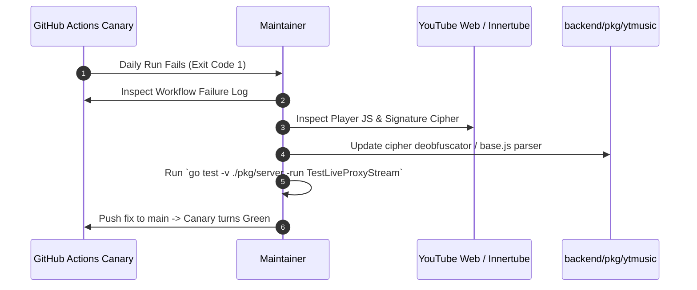

# Production Maintenance, Memory Hardening & Canary Playbook

This document defines the production hardening architecture, runtime memory boundaries, storage ring-buffer hygiene, and continuous stream verification for Unbound Music.

---

## Does the CI Canary Create a GitHub Release?

**No, absolutely not.**

Here is the exact distinction:
* **A GitHub Release** is only created when you use a specific `actions/create-release` or `gh release create` step, which is tied to version tags (e.g., `v1.0.0`) and attaches APK/AAB binaries.
* **The Innertube CI Canary** is purely a **silent, headless test job**. It runs in an isolated runner, tests `go test` / stream extraction, outputs a green checkmark (`PASS`) or red mark (`FAIL`) in the GitHub Actions tab, and exits.
* **Zero APKs are built, zero releases are created, zero tags are pushed, and zero assets are uploaded to GitHub Releases.** The Releases tab remains 100% clean and exclusively reserved for official APK drops.

Because the CI canary is completely decoupled from releases and produces no APKs, it is completely safe to implement without contaminating release versioning.

---

## Unified Architecture Overview (The 3 Pillars)

```mermaid
graph TD
    subgraph 1. Proactive Health Diagnostic (Zero Release Impact)
        CI[Innertube CI Canary] -->|Daily Cron 0 4 * * *| TEST[Headless Stream Probe]
        TEST -->|Pass: Green Checkmark / Fail: Alert| GH[GitHub Actions Log Only]
    end

    subgraph 2. Native Android Memory Hardening
        TRIM[Android onTrimMemory / onLowMemory] --> JNI[Native JNI Call: trimEngineMemoryNative]
        JNI --> GC[runtime.GC + debug.FreeOSMemory]
        BOOT[Engine Startup] --> CFG[debug.SetMemoryLimit 128MB + debug.SetGCPercent 50]
    end

    subgraph 3. Storage Ring-Buffer Hygiene
        SPOOL[Audio Spooled to Cache] --> CHECK{Cache > 750MB?}
        CHECK -->|Yes| LRU[Evict Oldest .opus Files to 80% / 600MB]
        CHECK -->|No| IDLE[No-op / Skip]
        PROT[Active Spooling Tracks] -.->|Protected| LRU
    end
```

---

## Pillar 1: Automated Daily Innertube CI Canary (No Releases, No APKs)

* **Target File:** `.github/workflows/innertube_canary.yml`
* **Trigger:** Daily at 04:00 UTC (`cron: '0 4 * * *'`) and manual trigger (`workflow_dispatch`).
* **Execution Environment:** Headless Ubuntu runner with Go 1.22+.
* **Behavior:**
  1. Checks out the repository.
  2. Sets up the Go toolchain.
  3. Executes `go test -v ./pkg/server -run TestLiveProxyStream` against real YouTube video IDs.
  4. Verifies HTTP `200 OK` or `206 Partial Content` stream resolution with valid byte payloads.
  5. Exits with code `0` on success or code `1` on failure.
* **Release Impact:** **None.** No artifacts, no APK compilation, zero tags pushed, and zero GitHub Releases created.

### Triage Protocol: What to Do When the Canary Returns Exit Code 1

When YouTube alters its player cipher, the daily canary will fail before users experience outages. Follow this triage sequence:



1. **Check the Action Log:** Look for whether the failure was an HTTP 403 Forbidden (signature cipher changed), HTTP 429 Too Many Requests (rate limiting), or a network timeout.
2. **Inspect the Player JS:** Navigate to `backend/pkg/ytmusic/stream.go` and `player.go`. Verify if YouTube changed the URL parameter names (`sig` vs `s`, `sp`), or modified the transformation function sequence in `base.js`.
3. **Verify Local Reproduction:** Run `go test -v -run TestLiveProxyStream ./backend/pkg/server` to confirm reproduction locally.
4. **Deploy Hotfix:** Commit the parser adjustment to `main`. The canary will automatically verify on next push or dispatch.

---

## Pillar 2: Go Engine Memory Ceiling & Native JNI Trimming

Because Unbound Music runs a native Go HTTP/IPC daemon embedded inside an Android application process, dual-GC harmony between Android ART and the Go runtime is paramount.

### Dual-GC Harmony Mechanics
* **Heap Boundary:** Go allocator is constrained to a 128 MiB soft heap ceiling via `debug.SetMemoryLimit(128 * 1024 * 1024)`.
* **Collection Frequency:** Set `debug.SetGCPercent(50)` at engine initialization to trigger GC sweeps more frequently and eliminate memory spikes during high-throughput audio streaming.
* **JNI Memory Trimming:**
  - Android `DaemonManager.kt` registers `ComponentCallbacks2`.
  - When `onTrimMemory(level)` receives `TRIM_MEMORY_RUNNING_LOW` (or higher), or when `onLowMemory()` triggers, it executes `trimEngineMemoryNative()`.
  - In Go:
    ```go
    func TrimEngineMemory() {
        runtime.GC()
        debug.FreeOSMemory()
    }
    ```
  - `debug.FreeOSMemory()` forces the Go runtime allocator to release all idle MADV_FREE / MADV_DONTNEED pages directly back to the Android Linux kernel, immediately reducing the process RSS footprint.

---

## Pillar 3: Bounded LRU Audio Cache Eviction

To protect user device storage and prevent disk exhaustion, the streaming reverse proxy implements an automatic ring-buffer disk cache:

### Rules & Thresholds
1. **Quota Ceiling:** 750 MB (`MaxAudioCacheSizeBytes = 750 * 1024 * 1024`).
2. **Hysteresis Target:** 80% (600 MB). When disk usage exceeds 750 MB, files are removed until usage drops below 600 MB. The 20% hysteresis gap prevents disk thrashing on consecutive song plays.
3. **Strict In-Flight Protection:**
   - Active spooling tracks (`spoolingTracks[videoID]`) are never eligible for eviction.
   - Temporary partial download files (`*.part`) are never evicted by the LRU cleaner.
4. **LRU Sorting:** Only completed `.opus` files are inspected and sorted by `ModTime()` (oldest accessed/modified first).

---

## Verification & Test Commands

| Component | Verification Command | Expected Outcome |
| :--- | :--- | :--- |
| **Pillar 1: Stream Canary** | `go test -v -run TestLiveProxyStream ./backend/pkg/server` | HTTP 200/206 resolved, exit code 0 |
| **Pillar 2: Memory Ceiling** | `go test -v -run TestConfigureMemoryCeiling ./backend/pkg/server` | Memory ceiling and GC percent applied |
| **Pillar 2: Memory Trimming** | `go test -v -run TestTrimEngineMemory ./backend/pkg/server` | Heap sweep and FreeOSMemory complete without blocking |
| **Pillar 3: LRU Eviction** | `go test -v -run TestAudioCachePruning ./backend/pkg/server` | Files pruned to 80% target, active spool protected |
| **Complete Backend Suite** | `go test ./...` in `backend` | All 28 packages pass |
