# Unbound Music Documentation

Unbound Music is an offline-first, on-device intelligent music streaming engine and player.

## Architecture Overview

```mermaid
graph TD
    UI[Compose Multiplatform UI] -->|HTTP REST / IPC| Daemon[Localhost Engine Daemon :45731]
    
    subgraph Audio Processing
        Daemon --> Stream[Innertube Opus/AAC Stream Extractor]
        Daemon --> Router[Zero-Data Hybrid Playback Interceptor]
        Daemon --> DSP[ReplayGain / DJ Crossfade / Silence Trimmer]
        Daemon --> AutoEq[AutoEq 4,000+ Headphone Calibration]
    end

    subgraph Lyrics & Visuals
        Daemon --> Lyrics[Uncensored Genius Scraper + LRCLIB Fallback]
        Daemon --> Aligner[On-Device Phonetic Syllable Aligner]
        Daemon --> Canvas[Spotify Canvas 8s Looping Video]
    end

    subgraph On-Device AI & Analytics
        Daemon --> EdgeAI[SmolLM2-135M + MiniLM Vector Search]
        Daemon --> Shazam[16kHz FFT Peak Constellation Shazam Subsystem]
        Daemon --> Rec[Offline Smart Radio Recommender]
        Daemon --> Analytics[On-Device Unbound Recap & Diversity Scoring]
    end

    subgraph Storage & Ecosystem
        Daemon --> SQLite[Pure-Go SQLite Memory Bank WAL Mode]
        Daemon --> Ingest[Smart Storage Ingestion Rules]
        Daemon --> P2P[Local Wi-Fi P2P Catalog Mesh Sync]
        Daemon --> Rooms[Shared Listening Rooms Sub-ms Sync]
        Daemon --> Discord[Discord Rich Presence IPC]
        Daemon --> Sponsor[SponsorBlock Video Skip Filter]
        Daemon --> LastFM[Last.fm 2.0 Scrobbler]
        Daemon --> Podcasts[Podcasts & Episode Chapters]
        Daemon --> Explore[Moods & Top 100 Charts]
        Daemon --> Artist[Artist Discography & Similar Artists]
        Daemon --> Sleep[Sleep Timer & Volume Fade-Out]
        Daemon --> Updater[GitHub Releases Auto-Updater]
    end
```



## API Endpoint Reference

The backend daemon runs on `http://127.0.0.1:45731` with the following REST endpoints:

### 1. Core Streaming & Search
* `GET /api/v1/status`: Engine health, RAM usage, and storage gatekeeper mode.
* `GET /api/v1/search?q=<query>`: Innertube catalog search.
* `GET /api/v1/stream?id=<video_id>`: Pure Opus / AAC stream extractor with zero-data local match routing.
* `GET /api/v1/lyrics?id=<track_id>&title=<title>&artist=<artist>`: Uncensored Genius lyrics with word-level phonetic alignment.

### 2. Audio Intelligence & Recognition
* `POST /api/v1/shazam/recognize`: Audio snippet identification via Shazam binary signature protocol.
* `POST /api/v1/shazam/file`: Direct file recognition from local storage.
* `POST /api/v1/ai/query`: Natural language semantic vibe search.
* `POST /api/v1/ai/mood`: Audio valence and emotional mood evaluator.

### 3. Audio Enhancement & Calibration
* `GET /api/v1/autoeq/search?q=<headphone_name>`: Search 4,000+ calibrated headphone profiles.
* `GET /api/v1/autoeq/preset?id=<headphone_id>`: 10-band parametric EQ curves.
* `POST /api/v1/audio/normalize`: ReplayGain / EBU R128 loudness volume leveling.
* `POST /api/v1/audio/crossfade?progress=<0.0-1.0>`: DJ crossfade volume blend curves.

### 4. Personal Library & Analytics
* `POST /api/v1/analytics/log`: Record song listening event.
* `GET /api/v1/analytics/recap`: Complete on-device Unbound Recap with decade breakdowns and entropy scores.
* `POST /api/v1/account/sync`: Sync YouTube Liked Music and playlists via cookies.
* `GET /api/v1/account/liked`: Retrieve synced Liked Music tracks.

### 5. Discovery & Exploration
* `GET /api/v1/explore/moods`: 8 curated Moods & Moments categories.
* `GET /api/v1/explore/charts?country=<iso_code>`: Top 100 trending charts.
* `GET /api/v1/artist/profile?name=<artist_name>`: Complete artist discography and similar artists.
* `GET /api/v1/canvas?title=<title>&artist=<artist>`: Spotify Canvas 8-second looping video MP4.
* `GET /api/v1/podcasts/browse?id=<podcast_id>`: Podcast show episodes and chapters.

### 6. Ecosystem & Utilities
* `POST /api/v1/import/spotify`: Scrapes public Spotify playlist links.
* `POST /api/v1/rooms/create`: Create synchronized listening room code.
* `POST /api/v1/rooms/join`: Join listening room.
* `GET  /api/v1/rooms/sync?code=<code>`: Sub-millisecond synchronized playback position.
* `POST /api/v1/discord/presence`: Update desktop Discord Rich Presence.
* `GET  /api/v1/sponsorblock?id=<video_id>`: Video skip segments.
* `POST /api/v1/sleeptimer/start`: Set sleep timer countdown.
* `GET  /api/v1/updater/check`: Check GitHub for new version releases.

## Running Tests

To verify all 28 packages in the Go engine:
```powershell
cd backend
go test -v ./...
```

To run individual automated subsystem test scripts:
```powershell
powershell -ExecutionPolicy Bypass -File ./test/test_search.ps1
powershell -ExecutionPolicy Bypass -File ./test/test_lyrics.ps1
powershell -ExecutionPolicy Bypass -File ./test/test_shazam.ps1
powershell -ExecutionPolicy Bypass -File ./test/test_advanced_features.ps1
powershell -ExecutionPolicy Bypass -File ./test/test_day11_features.ps1
```
